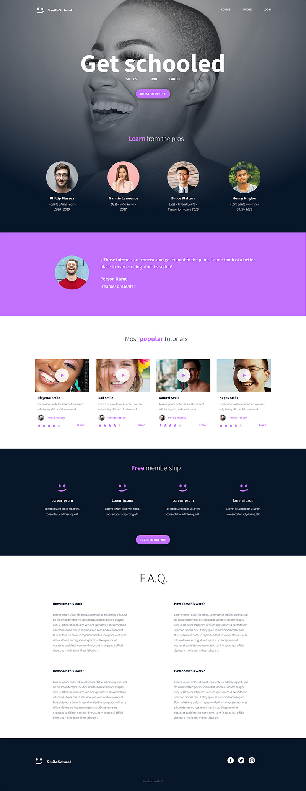

# Projet HTML/CSS/JavaScript

Ce projet consiste à créer un site web en utilisant uniquement HTML, CSS et JavaScript. L'objectif est de comprendre les fondamentaux du développement web front-end et de construire un site conforme aux normes du W3C.

## CSS

### Présentation
CSS (Cascading Style Sheets) est un langage de feuilles de style utilisé pour définir la présentation et l'apparence des éléments d'une page web écrite en HTML. Il permet de contrôler le design, la mise en page, les couleurs, les polices, etc.

### Liaison avec HTML
Le CSS est généralement inclus dans une page HTML via des balises <style> dans l'en-tête de la page, ou via un fichier externe avec l'attribut href dans la balise <link>. Il permet de séparer le contenu (HTML) de la présentation (CSS), ce qui facilite la maintenance et la mise à jour du site.

### Sélecteurs et Propriétés
En CSS, les sélecteurs sont des motifs utilisés pour sélectionner les éléments HTML auxquels appliquer des styles, tandis que les propriétés définissent les caractéristiques de ces éléments, telles que la couleur, la taille, la marge, etc. Par exemple, h1 est un sélecteur pour les titres de premier niveau, et color: blue; est une propriété pour définir la couleur du texte en bleu.

### Cascade et Spécificité
La cascade est un mécanisme par lequel les règles CSS sont appliquées et priorisées en fonction de leur spécificité et de leur ordre de déclaration. Les règles les plus spécifiques ou celles déclarées en dernier l'emportent sur les règles moins spécifiques ou celles déclarées en premier.

### Flexbox et Grid
CSS offre des modules comme Flexbox et Grid pour créer des mises en page complexes et responsives avec une gestion simplifiée de l'alignement, de l'espacement et du dimensionnement des éléments.